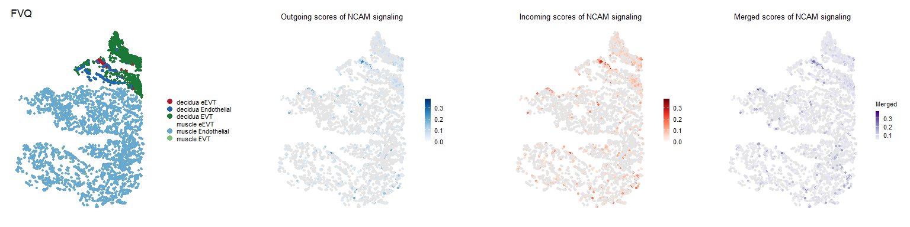
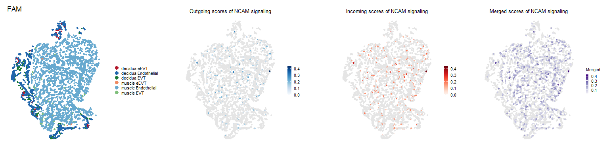
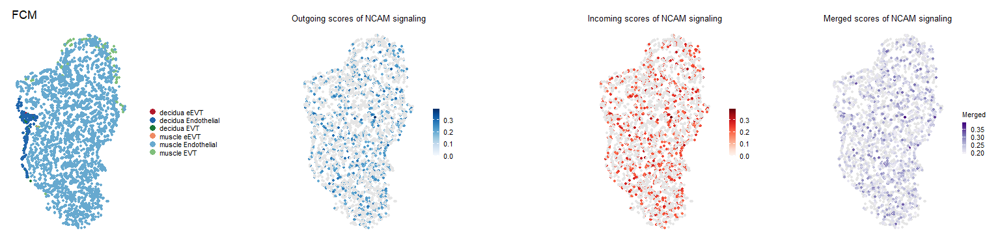
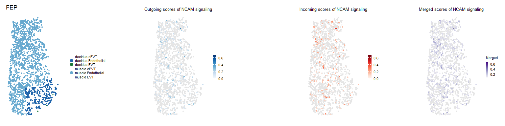
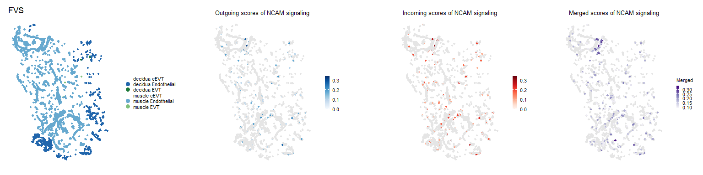
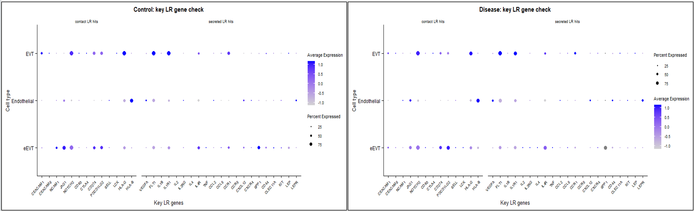

# Spatial Analysis at the Maternal-Fetal Interface in Severe Preeclampsia

This repository contains the analysis workflow for a pilot Xenium spatial
transcriptomics project investigating trophoblast-endothelial organization and
cell-cell communication in severe preeclampsia (PE).

The project began with an initial comparison of one control and one disease
sample, and then expanded to a six-donor dataset containing two controls and
four PE samples. The final single-donor and multisample SpatialCellChat
calculations were run as R scripts
on the Myriad computing cluster. The R Markdown files contain
detailed script and interpretation. Major results are shown below in
"Analysis Workflow and Preliminary Results".

**Supervisor:** Yara Elana Sanchez Corrales<br>
**Principal investigator:** Sergi Castellano Hereza<br>
**Analysis status:** preliminary study; additional samples and refined cell-type
annotations are in progress<br>
**Main question:** are extravillous trophoblast-endothelial spatial relationships
and candidate ligand-receptor communication programs altered in severe PE?

## Project Overview

Preeclampsia is associated with abnormal placentation and impaired spiral artery
remodeling. During normal pregnancy, extravillous trophoblasts (EVTs) invade the
maternal decidua and myometrium and interact with vascular endothelial cells as
spiral arteries are converted into low-resistance vessels. Spatial
transcriptomics makes it possible to examine both the physical organization of
these cells and the signaling programs that may operate between them.

This pilot analysis follows the group's study of fetal and maternal cell
contributions to severe PE across gestation [5]. It uses Xenium coordinates and
expression to examine the local organization of eEVTs and endothelial cells and
to prioritize possible communication pathways between them.

The analysis used a targeted 479-gene Xenium panel. The initial analysis
quantified nearest neighbors and intercellular distances while comparing one
control donor (FVB) with one disease donor (FAM). Ligand-receptor analysis was
explored with LIANA, including a nearest-neighbor-restricted version. Because
that restriction did not produce sufficiently useful spatial results, the final
workflow used SpatialCellChat to incorporate cell coordinates directly into
communication inference.

The cohort was subsequently expanded to six donors:

| Condition | Donors | Number of donors |
|---|---|---:|
| Control | FVB, FVQ | 2 |
| Severe PE | FAM, FCM, FEP, FVS | 4 |

The current results should be treated as hypothesis-generating. They establish
a working analysis framework and prioritize candidate pathways for a larger
cohort planned for future study.

```text
01 Nearest-neighbor preference and distance analysis
                         |
                         v
02 Exploratory LIANA ligand-receptor analysis
   whole tissue and k-nearest-neighbor-restricted subsets
                         |
                         v
03 Initial FVB-FAM SpatialCellChat comparison
                         |
                         v
04 Six-donor pooled comparison
                         |
                         v
05 Independent donor and individual-cell pathway follow-up
                         |
                         v
06 Cell-identity and candidate-gene checks
```

## Data and Analysis Design

Contact-dependent signaling uses a 20 micrometer contact range. Secreted
signaling uses a 250 micrometer interaction range. Both workflows calculate
cell-group pathway probabilities and individual-cell pathway probabilities.
The plot below illustrates the shorter contact range and the broader
interaction range used for secreted signaling.


*SpatialCellChat uses a 20 µm contact range for contact-dependent interactions
and a 250 µm interaction range for secreted signaling. The plots show the
distance distributions considered in each setting.*

The CellChat human database is supplemented with the candidate
`CLEC11A-KIT` interaction described in the maternal-fetal interface literature
[2].

The original data are not intended to be shown before formal result is published.

## Analysis Workflow and Preliminary Results

### 01. Spatial neighborhood exploration

[`Neigbour_analysis_exploration.Rmd`](Neigbour_analysis_exploration.Rmd)
compares endothelial extravillous trophoblasts (eEVTs) and maternal endothelial
cells in one control donor (FVB) and one PE donor (FAM).

#### Nearest-neighbor preference (NEP)

Within each donor and tissue region (decidua or muscle), I used
cell-centroid coordinates to find the *n* nearest other cells for every eEVT and
endothelial cell. I counted directed pairs from each query cell type to each
neighbor cell type, then divided by all neighbor
pairs from that query type in the same region. For example, the endothelial to
eEVT percentage is the number of endothelial cells whose nearest neighbor is
an eEVT divided by the number of endothelial query cells when *n* = 1. The
heatmaps below use *n* = 1; each row sums to 100%.

**Result.** In the decidua, 6.7% of endothelial cells in FVB had an eEVT as
their nearest neighbor, compared with 0.4% in FAM. This is an observed
neighborhood proportion, which also depends on eEVT abundance.


*Nearest-neighbor proportions in FVB (control) and FAM (PE),
split by decidua and muscle. Rows are query cell types; columns are neighbor
cell types; each row totals 100%.*

#### COZI

I also ran conditional neighborhood preference analysis
separately for FVB and FAM using each cell's three nearest neighbors and 300 label
permutations. This calculation uses each donor as a whole rather than separating
decidua and muscle.

**Result.** The initial pair suggests a weaker permutation-standardized eEVT
self-neighbor signal in FAM. With only one donor per condition, this does not
establish a reproducible PE effect. The difference in eEVT abundance also
complicates interpretation of endothelial-to-eEVT proportions.


*COZI for FVB and FAM using three nearest neighbors. Dot size is
the fraction of source cells with at least one indicated neighbor; color is the
neighbor-count z-score relative to 300 label permutations (red, higher than
expected; blue, lower).*

### 02. Exploratory LIANA analysis

[`Ligand-Receptor Exploration organized.Rmd`](Ligand-Receptor%20Exploration%20organized.Rmd)
compares FVB and FAM ligand-receptor results, including the eEVT-to-endothelial
direction. Because the original LIANA inference did not use cell coordinates,
I repeated it on cells with a nearby cell of the opposite type as an exploratory
contact-focused restriction.

**Result.** Few ligand-receptor pairs met the selected LIANA significance
threshold. Among selected pairs, expression-support scores for LEP–LEPR and
JAG1–NOTCH1 were lower in FAM, while SPP1–CD44 and FN1–CD44 were higher.
Restricting to nearby opposite-type cells changed little, so this branch did
not become the main communication analysis. The bars summarize ligand and
receptor expression, not a spatial interaction test.


*Selected eEVT-to-endothelial LR expression-support scores in
FVB (control) and FAM (PE). Left: all annotated cells. Right: JAG1–NOTCH1 after
requiring an opposite-type cell among the three nearest neighbors.*

### 03. Initial SpatialCellChat analysis

The initial SpatialCellChat comparison used one control (FVB)
and one PE donor (FAM). At this stage, the analyzed cell labels were **eEVT and Endothelial**;
EVT was added in the later six-donor analysis. SpatialCellChat used Xenium
expression and coordinates to infer contact-dependent and secreted signaling
separately.

**Result.** This initial pair suggested stronger contact-associated NOTCH and
CDH5 signaling in FVB and stronger inflammatory secreted programs in FAM.
These are one-donor-per-condition observations.


*Initial FVB–FAM pathway rankings. Left half:
contact-dependent signaling; right half: secreted signaling. Within each half,
relative information flow is plotted beside information flow.*


*Initial FVB–FAM cell-type signaling patterns. Left:
contact-dependent pathways; right: secreted pathways. Rows are pathways and
columns are eEVT or Endothelial cell groups in each condition.*

### 04. Six-donor condition comparison

The formal six-donor analysis added **EVT** alongside eEVT and
Endothelial.
The condition-level calculation was performed on Myriad with
[`SpatialCellChat_multisample_compute_myriad.R`](SpatialCellChat_multisample_compute_myriad.R).
The script groups FVB and FVQ as control and FAM, FCM, FEP, and FVS as disease.
[`Comparison-by-Cellchat-multiple-sample.Rmd`](Comparison-by-Cellchat-multiple-sample.Rmd)
contains the downstream control-disease comparison, including donor-averaged
interaction-count summaries and pooled condition-level comparisons.

**Result.** The pooled condition networks prioritize NOTCH and NCAM in control,
along with VEGF-associated secreted signaling. Disease shows stronger candidate
inflammatory programs, including TNF and interleukin pathways. These pooled
network differences are for pathway prioritization, not independent donor-level
statistical tests.


*Six-donor pooled pathway rankings. Left half:
contact-dependent signaling; right half: secreted signaling. Within each half,
relative information flow is plotted beside information flow for control
(two donors) and disease (four donors).*


*Six-donor pooled cell-type signaling patterns. Left:
contact-dependent pathways; right: secreted pathways. Rows are pathways and
columns are eEVT, Endothelial, or EVT cell groups in each condition.*

### 05. Independent donors and individual-cell pathway maps

I examined independently inferred donor objects from
[`SpatialCellChat_single_sample_compute_myriad.R`](SpatialCellChat_single_sample_compute_myriad.R)
to check how candidate pathways varied between samples. After this donor-level
review, I mapped selected pathway scores for **individual cells**. This returns
the inferred signal to its location in the tissue instead of ending at a
cell-type average. NCAM provides an example across all six independent donors.
In every map, the four panels show cell identities, outgoing NCAM scores,
incoming NCAM scores, and merged NCAM scores from left to right.

**Result.** In the two controls, NCAM-scored cells appear more concentrated
around regions rich in eEVT and some EVT. In disease, they appear more dispersed
across the tissue rather than forming the same localized pattern. This is a
visual, donor-level observation: tissue shapes and score color scales differ
between donors, and the maps do not directly measure ligand-receptor binding.

#### Control donors

| FVB |
|:---|
|  |

| FVQ |
|:---|
|  |

---

#### Disease donors

| FAM |
|:---|
|  |

| FCM |
|:---|
|  |

| FEP |
|:---|
|  |

| FVS |
|:---|
|  |

### 06. Six-donor quality checks

I checked identities assigned after Xenium cell segmentation
and annotation using marker expression for eEVT, Endothelial, and EVT. I also
checked selected genes behind candidate contact and secreted ligand-receptor
pathways. Both checks use pooled control cells from FVB and FVQ and pooled PE
cells from FAM, FCM, FEP, and FVS.

**Result.** Marker patterns are broadly consistent with the assigned cell
types, with no obvious identity mismatch. For example, eEVT cells show
detectable HLA-G and KRT7, with a weaker CXCR6 signal; these genes are not
specific to eEVT in these plots. The selected LR genes are detected in the
expected cell-type compartments. These checks support interpretation of the
inferred pathways but do not directly validate segmentation boundaries,
establish physical communication, or provide donor-level significance.


*Cell-identity marker expression in pooled control (left) and
PE (right) cells, grouped as eEVT, Endothelial, and EVT. Dot size is the
expressing-cell fraction; color is scaled average expression.*



*Selected contact-dependent and secreted LR-gene expression in
pooled control (left) and PE (right) cells. Dot size is the expressing-cell
fraction; color is scaled average expression.*

## Interpretation of the Multisample Comparison

The repository contains two related but distinct forms of comparison:

- **Donor-level summaries** are calculated from the six independently inferred
  SpatialCellChat objects.
- **Pooled condition objects** retain donor identity through the `samples`
  field but infer one communication network for all control cells and one for
  all disease cells. RankNet, centrality, and several differential network plots
  describe these pooled objects.

The pooled plots are useful for pathway prioritization, but they do not
constitute a donor-level statistical test. The unequal cohort size of two
controls and four disease donors should also be considered when interpreting
condition-level differences.

## Overall Conclusion

This pilot project established an end-to-end workflow for spatial neighborhood
analysis and ligand-receptor inference in Xenium data from the maternal-fetal
interface. The work progressed from an initial one-control, one-disease
comparison to a six-donor SpatialCellChat analysis.

The initial COZI comparison suggested a weaker permutation-standardized eEVT
self-neighbor signal in FAM than in FVB. This one-donor-per-condition
observation remains exploratory rather than establishing a reproducible PE
effect.

Across the exploratory analyses, NOTCH, NCAM, CLEC11A, VEGF, and inflammatory signaling
emerged as candidates for follow-up. The evidence remains preliminary, but it
provides a focused set of hypotheses and a reusable computational framework for
the group's planned expanded study.

## Limitations and Next Steps

- The cohort contains only two control and four disease donors.
- A targeted 479-gene panel limits the number of ligand-receptor pairs that can
  be detected.
- Current cell-type annotations remain incomplete and may combine biologically
  distinct trophoblast, endothelial, stromal, or immune subpopulations.
- Additional donors, expanded annotations, donor-level statistical analysis,
  and independent biological validation are required before drawing firm
  disease-mechanism conclusions.

## Repository Structure

```text
.
+-- Neigbour_analysis_exploration.Rmd
+-- Ligand-Receptor Exploration organized.Rmd
+-- Comparison-by-Cellchat-multiple-sample.Rmd
+-- SpatialCellChat_single_sample_compute_myriad.R
+-- SpatialCellChat_multisample_compute_myriad.R
+-- figures/
+-- README.md
```

## Main Analysis Files and Figures

| Stage | File or figure | Purpose |
|---:|---|---|
| 01 | [Neigbour_analysis_exploration.Rmd](Neigbour_analysis_exploration.Rmd) | Nearest-neighbor composition, distance, k sensitivity, and COZI exploration |
| 02 | [Ligand-Receptor Exploration organized.Rmd](Ligand-Receptor%20Exploration%20organized.Rmd) | eEVT-endothelial LIANA workflow and k-nearest-neighbor-restricted exploration |
| 03 | [Initial contact and secreted pathway comparison](figures/initial-cellchat-ranknet.png) | FVB-FAM SpatialCellChat results; eEVT and Endothelial only |
| 04 | [SpatialCellChat_multisample_compute_myriad.R](SpatialCellChat_multisample_compute_myriad.R) and [comparison notebook](Comparison-by-Cellchat-multiple-sample.Rmd) | Six-donor pooled control and disease networks, including EVT |
| 05 | [SpatialCellChat_single_sample_compute_myriad.R](SpatialCellChat_single_sample_compute_myriad.R) | Independent donor objects and individual-cell pathway scores |
| 06 | [Comparison-by-Cellchat-multiple-sample.Rmd](Comparison-by-Cellchat-multiple-sample.Rmd) | Cell-identity and selected ligand-receptor gene checks |

## Software

The analysis is written in R. Packages used across the workflows include:

- Seurat
- SpatialCellChat and CellChat
- LIANA
- RANN and coziR
- Matrix, dplyr, tidyr, and tibble
- ggplot2, patchwork, and ComplexHeatmap
- future

## References

1. Dimitrov D, Türei D, Garrido-Rodriguez M, et al. *Comparison of methods and
   resources for cell-cell communication inference from single-cell RNA-Seq
   data.* Nature Communications. 2022;13:3224.
   [doi:10.1038/s41467-022-30755-0](https://doi.org/10.1038/s41467-022-30755-0)
2. Greenbaum S, Averbukh I, Soon E, et al. *A spatially resolved timeline of the
   human maternal-fetal interface.* Nature. 2023;619:595-605.
   [doi:10.1038/s41586-023-06298-9](https://doi.org/10.1038/s41586-023-06298-9)
3. Jin S, Plikus MV, Nie Q. *CellChat for systematic analysis of cell-cell
   communication from single-cell transcriptomics.* Nature Protocols.
   2025;20:180-219.
   [doi:10.1038/s41596-024-01045-4](https://doi.org/10.1038/s41596-024-01045-4)
4. Schiller C, Ibarra-Arellano MA, Bestak K, Tanevski J, Schapiro D.
   *Comparison and optimization of cellular neighbor preference methods for
   quantitative tissue analysis.* Nature Communications. 2026;17.
   [doi:10.1038/s41467-026-71699-z](https://doi.org/10.1038/s41467-026-71699-z)
5. Sanchez-Corrales YE, Xenakis T, Moreno-Villena JJ, et al. *Spatially
   resolved fetal and maternal cell contributions to severe preeclampsia
   across gestation.* Science Advances. 2026;12(30):eaed8964.
   [doi:10.1126/sciadv.aed8964](https://doi.org/10.1126/sciadv.aed8964)
