# Spatial Analysis at the Maternal-Fetal Interface in Severe Preeclampsia

This repository contains the analysis workflow for a pilot Xenium spatial
transcriptomics project investigating trophoblast-endothelial organization and
cell-cell communication in severe preeclampsia (PE).

The project began with an initial comparison of one control and one disease
sample, and then expanded to a six-donor dataset containing two controls and
four PE samples. The final single-donor and multisample SpatialCellChat
calculations were run as R scripts
on the Myriad computing cluster. The R Markdown files contain
detailed script and interpretation. Major results are shown below in
"Analysis Workflow and Preliminary Results".

**Supervisor:** Yara Elana Sanchez Corrales<br>
**Principal investigator:** Sergi Castellano Hereza<br>
**Analysis status:** preliminary study; additional samples and refined cell-type
annotations are in progress<br>
**Main question:** are extravillous trophoblast-endothelial spatial relationships
and candidate ligand-receptor communication programs altered in severe PE?

## Project Overview

Preeclampsia is associated with abnormal placentation and impaired spiral artery
remodeling. During normal pregnancy, extravillous trophoblasts (EVTs) invade the
maternal decidua and myometrium and interact with vascular endothelial cells as
spiral arteries are converted into low-resistance vessels. Spatial
transcriptomics makes it possible to examine both the physical organization of
these cells and the signaling programs that may operate between them.

This pilot analysis follows the group's study of fetal and maternal cell
contributions to severe PE across gestation [5]. It uses Xenium coordinates and
expression to examine the local organization of eEVTs and endothelial cells and
to prioritize possible communication pathways between them.

The analysis used a targeted 479-gene Xenium panel. The initial analysis
quantified nearest neighbors and intercellular distances while comparing one
control donor (FVB) with one disease donor (FAM). Ligand-receptor analysis was
explored with LIANA, including a nearest-neighbor-restricted version. Because
that restriction did not produce sufficiently useful spatial results, the final
workflow used SpatialCellChat to incorporate cell coordinates directly into
communication inference.

The cohort was subsequently expanded to six donors:

| Condition | Donors | Number of donors |
|---|---|---:|
| Control | FVB, FVQ | 2 |
| Severe PE | FAM, FCM, FEP, FVS | 4 |

The current results should be treated as hypothesis-generating. They establish
a working analysis framework and prioritize candidate pathways for a larger
cohort planned for future study.

```text
01 Xenium spatial data and cell-type annotations
                         |
                         v
02 Nearest-neighbor preference and distance analysis
                         |
                         v
03 Exploratory LIANA ligand-receptor analysis
   whole tissue and k-nearest-neighbor-restricted subsets
                         |
                         v
04 Initial FVB-FAM SpatialCellChat comparison
                         |
                         v
05 Six-donor pooled comparison
                         |
                         v
06 Independent donor and individual-cell pathway follow-up
                         |
                         v
07 Cell-identity and candidate-gene checks
```

## Data and Analysis Design

Contact-dependent signaling uses a 20 micrometer contact range. Secreted
signaling uses a 250 micrometer interaction range. Both workflows calculate
cell-group pathway probabilities and individual-cell pathway probabilities.
The plot below illustrates the shorter contact range and the broader
interaction range used for secreted signaling.

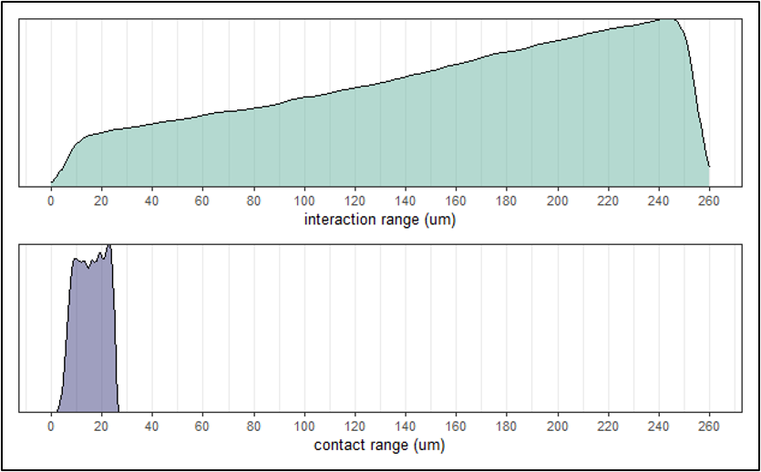

*SpatialCellChat uses a 20 µm contact range for contact-dependent interactions
and a 250 µm interaction range for secreted signaling. The plots show the
distance distributions considered in each setting.*

The CellChat human database is supplemented with the candidate
`CLEC11A-KIT` interaction described in the maternal-fetal interface literature
[2].

The original data are not intended to be shown before formal result is published.

## Analysis Workflow and Preliminary Results

### 01. Spatial neighborhood exploration

[`Neigbour_analysis_exploration.Rmd`](Neigbour_analysis_exploration.Rmd)
compares endothelial extravillous trophoblasts (eEVTs) and maternal endothelial
cells in one control donor (FVB) and one PE donor (FAM).

**Nearest-neighbor preference (NEP).** Within each donor and tissue region
(decidua or muscle), I used cell-centroid coordinates to find the *n* nearest
other cells for every eEVT and endothelial cell. I counted directed pairs from
each query cell type to each neighbor cell type, then divided by all neighbor
pairs from that query type in the same region. For example, the endothelial to
eEVT percentage is the number of endothelial cells whose nearest neighbor is
an eEVT divided by the number of endothelial query cells when *n* = 1. The
heatmaps below use *n* = 1; each row sums to 100%. 

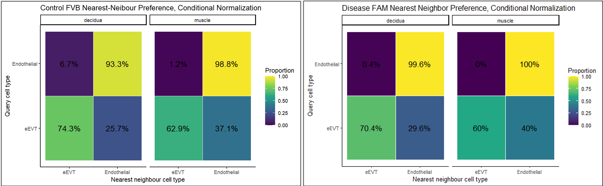

*Rows show the query cell type and columns show the neighbor cell type. In the
decidua, 6.7% of endothelial cells in FVB had an eEVT as their nearest neighbor,
compared with 0.4% in FAM. These proportions describe the observed neighborhood
composition and depend on how many eEVTs are present.*

**COZI.** I also ran conditional neighborhood preference analysis separately
for FVB and FAM using each cell's three nearest neighbors and 300 label
permutations. This calculation uses each donor as a whole rather than separating
decidua and muscle. In the dot plots, dot size is the conditional cell ratio (the
fraction of source cells with at least one neighbor of the indicated type).
Color is the z-score for the conditional neighbor count relative to the
permuted cell labels: positive values indicate a higher value than expected
under that null model, and negative values indicate a lower value.

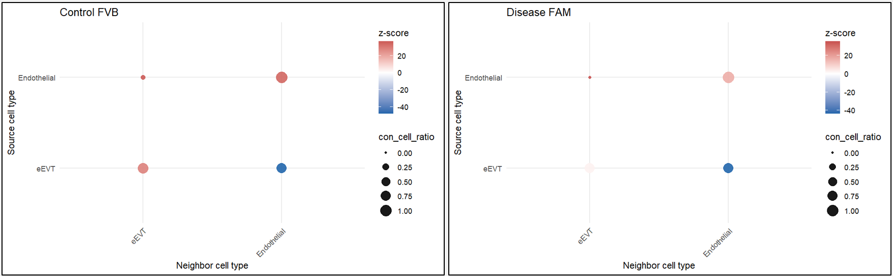

*The initial pair suggests a weaker permutation-standardized eEVT self-neighbor
signal in FAM.
Because this comparison includes only one donor per condition, the figure does
not establish a reproducible PE effect. The marked difference in eEVT abundance
also complicates interpretation of endothelial to eEVT proportions.*

### 02. Exploratory LIANA analysis

[`Ligand-Receptor Exploration organized.Rmd`](Ligand-Receptor%20Exploration%20organized.Rmd)
compares the FVB and FAM ligand-receptor results, including the eEVT to
endothelial direction. Few ligand-receptor pairs met the selected LIANA
significance threshold. Among the selected pairs, the expression-support plot
shows lower LEP–LEPR and JAG1–NOTCH1 scores in FAM, while SPP1–CD44 and
FN1–CD44 score higher. These bars summarize ligand and receptor expression;
they are not a spatial interaction test.

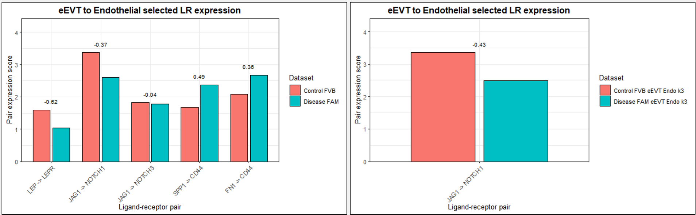

*The left panel uses all annotated eEVT and endothelial cells in each donor.
The right panel shows JAG1–NOTCH1 after restricting to cells with an opposite
cell type among their three nearest neighbors. The direction of this candidate
change remains similar.*

The original LIANA inference did not use cell coordinates. I therefore repeated
the analysis on cells with a nearby cell of the opposite type as an exploratory
contact-focused restriction. The overall findings changed little, so this
branch did not become the main communication analysis.

### 03. Initial SpatialCellChat analysis

The initial SpatialCellChat comparison used one control (FVB) and one PE donor
(FAM). At this stage, the analyzed cell labels were **eEVT and Endothelial**;
EVT was added in the later six-donor analysis. SpatialCellChat used Xenium
expression and coordinates to infer contact-dependent and secreted signaling
separately.

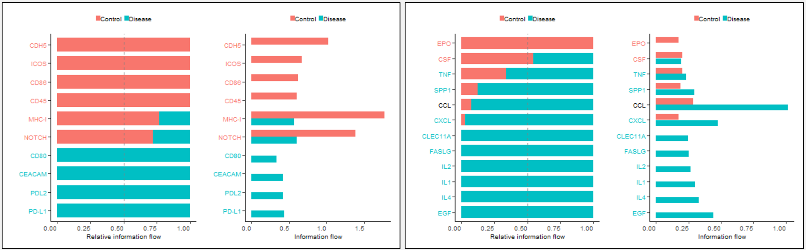

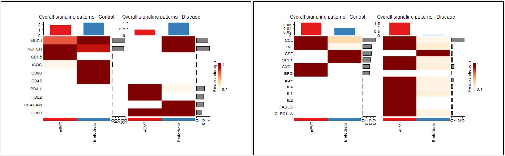

*The initial pair suggested stronger contact-associated NOTCH and CDH5
signaling in FVB and stronger inflammatory secreted programs in FAM. These
figures summarize one donor per condition.*

### 04. Six-donor condition comparison

The formal six-donor analysis added **EVT** alongside eEVT and Endothelial.
The condition-level calculation was performed on Myriad with
[`SpatialCellChat_multisample_compute_myriad.R`](SpatialCellChat_multisample_compute_myriad.R).
The script groups FVB and FVQ as control and FAM, FCM, FEP, and FVS as disease.
[`Comparison-by-Cellchat-multiple-sample.Rmd`](Comparison-by-Cellchat-multiple-sample.Rmd)
contains the downstream control-disease comparison, including donor-averaged
interaction-count summaries and pooled condition-level comparisons.

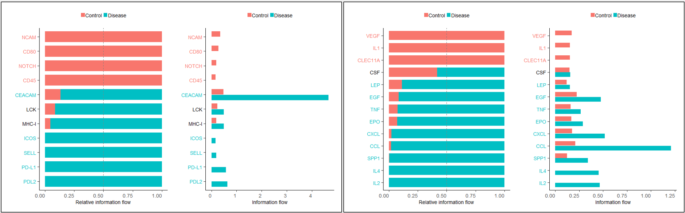

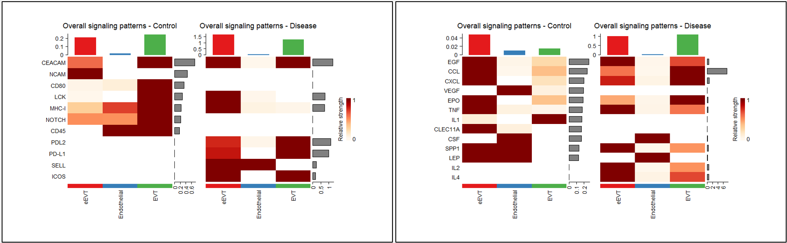

*These pooled comparisons prioritize NOTCH and NCAM in control, along with
VEGF-associated secreted signaling. Disease shows stronger candidate
inflammatory programs, including TNF and interleukin pathways. The plots
compare condition-level networks, not independent donor estimates.*

### 05. Independent donors and individual-cell pathway maps

I next examined independently inferred donor objects from
[`SpatialCellChat_single_sample_compute_myriad.R`](SpatialCellChat_single_sample_compute_myriad.R)
to check how candidate pathways varied between samples. After this donor-level
review, I mapped selected pathway scores for **individual cells**. This returns
the inferred signal to its location in the tissue instead of ending at a
cell-type average. The example below shows NCAM signaling in control donor FVB.

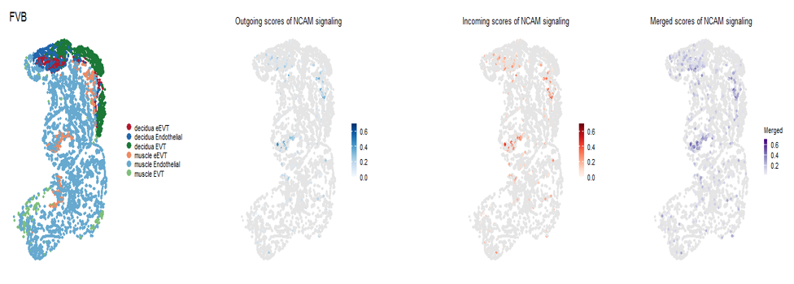

*The left panel shows cell identity and location; the next three panels map
outgoing, incoming, and merged inferred NCAM scores for individual cells. These
maps help locate candidate signaling within a donor and do not directly measure
ligand-receptor binding.*

### 06. Cell identity and candidate-gene checks

Before interpreting pathway differences, I checked whether eEVT, Endothelial,
and EVT labels were supported by marker expression in the pooled control and
disease cells. The panels include immune and chemokine genes alongside lineage
markers such as HLA-G, KRT7, and PECAM1. Dot size shows the fraction of cells
expressing each gene; color shows scaled average expression.

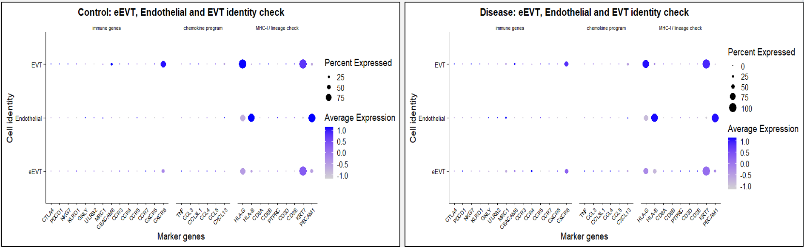

I then checked the expression of selected ligand and receptor genes underlying
the candidate contact and secreted pathways. These dot plots show whether the
genes are detected in the relevant cell populations; they support
interpretation of the inferred networks but do not independently establish
physical communication.

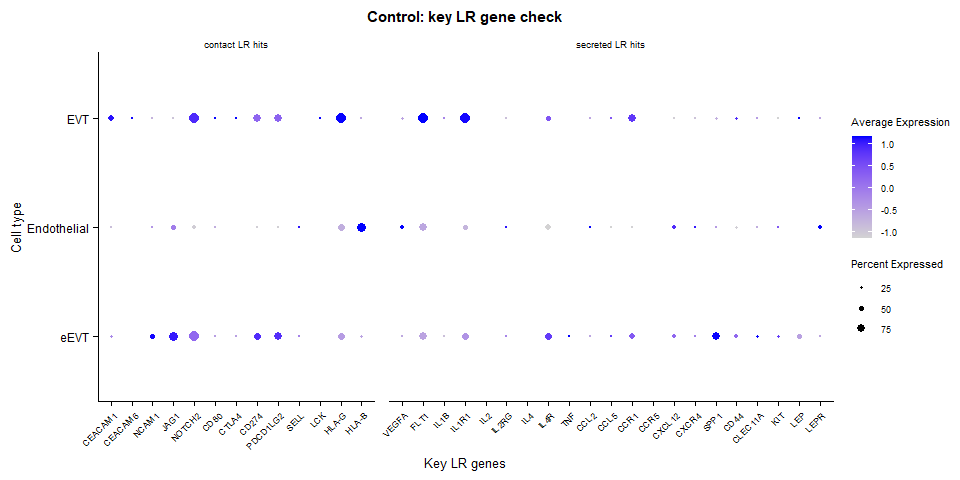

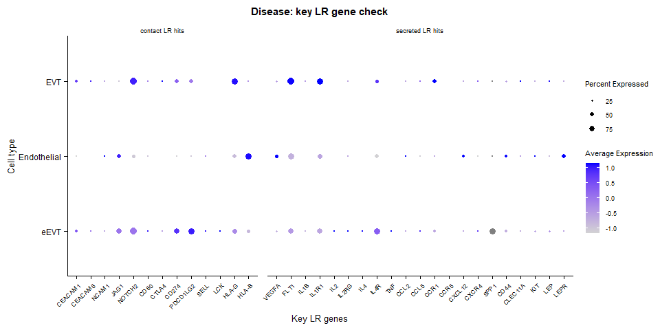

## Interpretation of the Multisample Comparison

The repository contains two related but distinct forms of comparison:

- **Donor-level summaries** are calculated from the six independently inferred
  SpatialCellChat objects.
- **Pooled condition objects** retain donor identity through the `samples`
  field but infer one communication network for all control cells and one for
  all disease cells. RankNet, centrality, and several differential network plots
  describe these pooled objects.

The pooled plots are useful for pathway prioritization, but they do not
constitute a donor-level statistical test. The unequal cohort size of two
controls and four disease donors should also be considered when interpreting
condition-level differences.

## Overall Conclusion

This pilot project established an end-to-end workflow for spatial neighborhood
analysis and ligand-receptor inference in Xenium data from the maternal-fetal
interface. The work progressed from an initial one-control, one-disease
comparison to a six-donor SpatialCellChat analysis.

Across the exploratory analyses, NOTCH, NCAM, CLEC11A, VEGF, and inflammatory signaling
emerged as candidates for follow-up. The evidence remains preliminary, but it
provides a focused set of hypotheses and a reusable computational framework for
the group's planned expanded study.

## Limitations and Next Steps

- The cohort contains only two control and four disease donors.
- A targeted 479-gene panel limits the number of ligand-receptor pairs that can
  be detected.
- Current cell-type annotations remain incomplete and may combine biologically
  distinct trophoblast, endothelial, stromal, or immune subpopulations.
- Additional donors, expanded annotations, donor-level statistical analysis,
  and independent biological validation are required before drawing firm
  disease-mechanism conclusions.

## Repository Structure

```text
.
+-- Neigbour_analysis_exploration.Rmd
+-- Ligand-Receptor Exploration organized.Rmd
+-- Comparison-by-Cellchat-multiple-sample.Rmd
+-- SpatialCellChat_single_sample_compute_myriad.R
+-- SpatialCellChat_multisample_compute_myriad.R
+-- figures/
|   +-- nearest-neighbor-proportions.png
|   +-- cozi-scores.png
|   +-- spatialcellchat-ranges.png
|   +-- liana-selected-lr-expression.png
|   +-- initial-cellchat-ranknet.png
|   +-- initial-cellchat-patterns.png
|   +-- six-donor-cellchat-ranknet.png
|   +-- six-donor-cellchat-patterns.png
|   +-- fvb-ncam-cell-map.png
|   +-- cell-identity-check.png
|   +-- key-lr-control.png
|   +-- key-lr-disease.png
+-- README.md
```

## Main Analysis Files and Figures

| Stage | File or figure | Purpose |
|---:|---|---|
| 01 | [Neigbour_analysis_exploration.Rmd](Neigbour_analysis_exploration.Rmd) | Nearest-neighbor composition, distance, k sensitivity, and COZI exploration |
| 02 | [Ligand-Receptor Exploration organized.Rmd](Ligand-Receptor%20Exploration%20organized.Rmd) | eEVT-endothelial LIANA workflow and k-nearest-neighbor-restricted exploration |
| 03 | [Initial contact and secreted pathway comparison](figures/initial-cellchat-ranknet.png) | FVB-FAM SpatialCellChat results; eEVT and Endothelial only |
| 04 | [SpatialCellChat_multisample_compute_myriad.R](SpatialCellChat_multisample_compute_myriad.R) and [comparison notebook](Comparison-by-Cellchat-multiple-sample.Rmd) | Six-donor pooled control and disease networks, including EVT |
| 05 | [SpatialCellChat_single_sample_compute_myriad.R](SpatialCellChat_single_sample_compute_myriad.R) | Independent donor objects and individual-cell pathway scores |
| 06 | [Comparison-by-Cellchat-multiple-sample.Rmd](Comparison-by-Cellchat-multiple-sample.Rmd) | Cell-identity and selected ligand-receptor gene checks |

## Software

The analysis is written in R. Packages used across the workflows include:

- Seurat
- SpatialCellChat and CellChat
- LIANA
- RANN and coziR
- Matrix, dplyr, tidyr, and tibble
- ggplot2, patchwork, and ComplexHeatmap
- future

## References

1. Dimitrov D, Türei D, Garrido-Rodriguez M, et al. *Comparison of methods and
   resources for cell-cell communication inference from single-cell RNA-Seq
   data.* Nature Communications. 2022;13:3224.
   [doi:10.1038/s41467-022-30755-0](https://doi.org/10.1038/s41467-022-30755-0)
2. Greenbaum S, Averbukh I, Soon E, et al. *A spatially resolved timeline of the
   human maternal-fetal interface.* Nature. 2023;619:595-605.
   [doi:10.1038/s41586-023-06298-9](https://doi.org/10.1038/s41586-023-06298-9)
3. Jin S, Plikus MV, Nie Q. *CellChat for systematic analysis of cell-cell
   communication from single-cell transcriptomics.* Nature Protocols.
   2025;20:180-219.
   [doi:10.1038/s41596-024-01045-4](https://doi.org/10.1038/s41596-024-01045-4)
4. Schiller C, Ibarra-Arellano MA, Bestak K, Tanevski J, Schapiro D.
   *Comparison and optimization of cellular neighbor preference methods for
   quantitative tissue analysis.* Nature Communications. 2026;17.
   [doi:10.1038/s41467-026-71699-z](https://doi.org/10.1038/s41467-026-71699-z)
5. Sanchez-Corrales YE, Xenakis T, Moreno-Villena JJ, et al. *Spatially
   resolved fetal and maternal cell contributions to severe preeclampsia
   across gestation.* Science Advances. 2026;12(30):eaed8964.
   [doi:10.1126/sciadv.aed8964](https://doi.org/10.1126/sciadv.aed8964)
